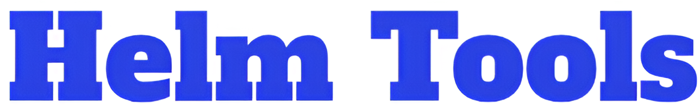

## About

Container image with a bunch of useful Helm tools.\
Useful for easy local development of Helm charts.

## Includes

- helm
- helm-docs
- helmfile
- kubectl
- make & task (taskfile)
- Several helm plugins
- kubeconform, kube-score, kube-linter
- yq & jq

## Run Locally

#### Clone

```bash
git clone https://github.com/KJone1/helm-tools.git
```

#### Build the image

- Using taskfile:
  ```bash
  task build # defaults to latest tag
  ```
  or
  ```bash
  task build -- v1
  ```
- Using CLI
  ```bash
  sudo docker build -f helm-tools.Dockerfile -t helm-tools:v1 .
  ```

#### Run

```bash
sudo docker run -v {dir with helm chart}:/opt/charts -it helmtools:v1 ash
```

## Authors

- [@KJone1](https://github.com/KJone1)
